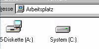

<div align="center">

## Very cool Splashscreen effect


</div>

### Description

I think it is one of the coolest Splashscreens I have ever seen on PSC. Usefull for everyone who wants to have a professional looking gui for his apps. More effects comming soon. The speed is also adjustable.
 
### More Info
 


<span>             |<span>
---                |---
**Submitted On**   |2002-04-06 14:14:08
**By**             |[dA riPpA\!](https://github.com/Planet-Source-Code/PSCIndex/blob/master/ByAuthor/da-rippa.md)
**Level**          |Beginner
**User Rating**    |4.8 (167 globes from 35 users)
**Compatibility**  |VB 4\.0 \(32\-bit\), VB 5\.0, VB 6\.0
**Category**       |[Miscellaneous](https://github.com/Planet-Source-Code/PSCIndex/blob/master/ByCategory/miscellaneous__1-1.md)
**World**          |[Visual Basic](https://github.com/Planet-Source-Code/PSCIndex/blob/master/ByWorld/visual-basic.md)
**Archive File**   |[Very\_cool\_69368462002\.zip](https://github.com/Planet-Source-Code/da-rippa-very-cool-splashscreen-effect__1-33517/archive/master.zip)

### API Declarations

```
Public Declare Function BitBlt Lib "gdi32.dll" (ByVal hdcDest As Long, ByVal nXDest As Long, ByVal nYDest As Long, ByVal nWidth As Long, ByVal nHeight As Long, ByVal hdcSrc As Long, ByVal nXSrc As Long, ByVal nYSrc As Long, ByVal dwRop As Long) As Long
Public Declare Function ReleaseDC Lib "user32" (ByVal hWnd As Long, ByVal hdc As Long) As Long
Public Declare Function GetDC Lib "user32" (ByVal hWnd As Long) As Long
Public Declare Function GetDesktopWindow Lib "user32" () As Long
Public Declare Function SetPixel Lib "gdi32" (ByVal hdc As Long, ByVal x As Long, ByVal Y As Long, ByVal crColor As Long) As Long
Public Declare Function GetPixel Lib "gdi32" (ByVal hdc As Long, ByVal x As Long, ByVal Y As Long) As Long
Public Declare Function GetTickCount Lib "kernel32" () As Long
```


